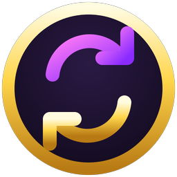
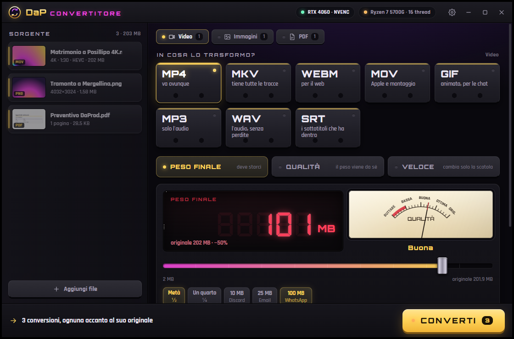
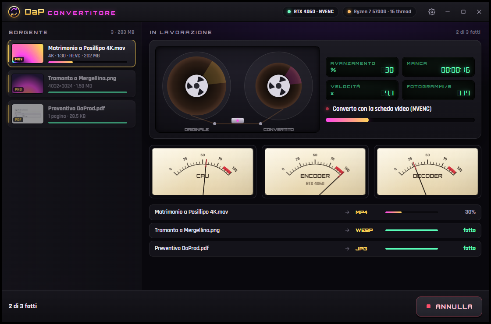
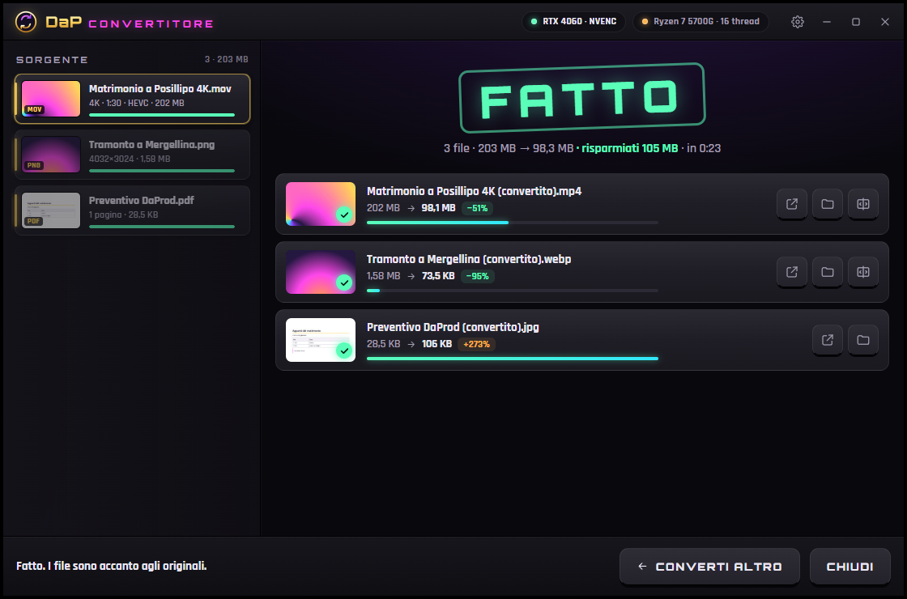
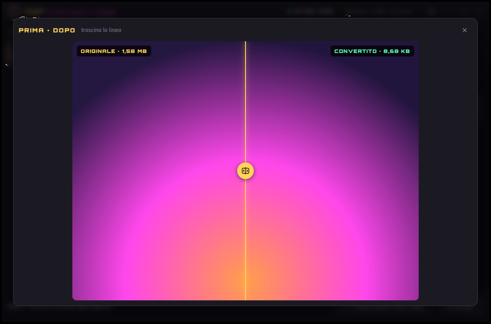
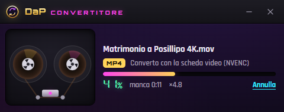

<div align="center">



# DaP Convertitore

**Tasto destro su un file → DaP Convertitore. Fatto.**

Video, audio, foto, PDF, documenti, archivi: qualsiasi file, nel formato che vuoi.
Il risultato compare accanto all'originale, col nome `(convertito)`.
Usa la scheda video (NVIDIA, AMD, Intel) quando c'è, la CPU quando serve. Tutto sul tuo PC.

[](https://github.com/cammo22/DaP-Convertitore/releases/latest)
[](#requisiti)
[](#la-scheda-video)
[](TERZE-PARTI.md)
[](LICENSE)


**[⬇ Scarica per Windows](https://github.com/cammo22/DaP-Convertitore/releases/latest/download/DaPConvertitore-win-Setup.exe)** ·
[Tutte le versioni](https://github.com/cammo22/DaP-Convertitore/releases) ·
[Novità](CHANGELOG.md)

</div>

---

<div align="center">

</div>

## Installare

1. Scarica **[DaPConvertitore-win-Setup.exe](https://github.com/cammo22/DaP-Convertitore/releases/latest/download/DaPConvertitore-win-Setup.exe)**.
2. Doppio clic. Si installa da solo per il tuo utente, **senza chiedere la password di amministratore**, e
   mette la voce nel tasto destro.
   Se Windows SmartScreen avvisa (l'app non è firmata): *Ulteriori informazioni → Esegui comunque*.
3. Fine. Gli aggiornamenti arrivano da soli: si scarica solo la differenza.

Non vuoi installare niente? C'è anche `DaPConvertitore-win-Portable.zip` nella stessa
[release](https://github.com/cammo22/DaP-Convertitore/releases/latest): scompatti e parte (senza tasto destro).
Per toglierlo: *Impostazioni → App → DaP Convertitore → Disinstalla*, e la voce sparisce anche dal menu.

## Come si usa

**Tasto destro** su uno o più file. Nel menu di Windows 11 ci sono due voci:

- **DaP Convertitore** apre la piastra coi file scelti, con tutte le regolazioni;
- **Converti al volo ›** ha le conversioni rapide del tipo di file (MP4, Metà peso, Solo l'audio, JPG, Pagine in
  JPG, Estrai qui…): partono subito in una finestrella in basso a destra con le bobine che girano, e alla fine
  arriva la notifica di Windows con **Apri** e **Mostra nella cartella**.

> **Il tasto destro nuovo di Windows 11** vuole un comando firmato: alla prima apertura il convertitore propone
> **Attiva**, e Windows chiede il permesso **una volta sola** (serve a fidarsi del certificato di DaProd; dopo,
> aggiornamenti compresi, non chiede più niente). Sulle versioni più nuove di Windows 11 le voci delle app possono
> stare sotto **«Estensioni app»**: da *Impostazioni → Personalizzazione → Menu contestuale* le porti in cima.
> Le stesse voci ci sono anche nel menu classico (Maiusc + tasto destro, o «Mostra altre opzioni»), in
> **Invia a → DaP Convertitore**, e puoi trascinare i file dentro la finestra.

Con più file selezionati va tutto in un colpo: un video per volta sulla scheda video, il resto in parallelo.
Le conversioni che uniscono (tante foto in **un PDF solo**, **unisci PDF**, **cartelle in uno ZIP**) mettono i
file in ordine di nome, come li vedi in Esplora file.

**Il nome**: `Vacanze.mov` diventa `Vacanze (convertito).mp4`, nella stessa cartella. Se c'è già,
`(convertito 2)`. Non si sovrascrive mai niente, e se annulli non resta un file a metà. La parola fra
parentesi si cambia nelle impostazioni.

**L'originale nel Cestino**: quando il convertito ne prende il posto (MOV → MP4, PNG → JPG, DOCX → PDF…),
a conversione riuscita l'originale va nel **Cestino di Windows**: se ti serve lo ripeschi. È acceso di
partenza e si spegne in Impostazioni. Non succede quando ne tiri fuori un pezzo (l'audio di un video, il testo
di un PDF, le pagine in JPG), quando unisci più file, né su chiavette e dischi di rete, dove Windows il Cestino
non ce l'ha. La piastra lo dice prima di premere CONVERTI.

| La piastra mentre lavora | Fatto: quanto pesava, quanto pesa |
| --- | --- |
|  |  |

| Prima e dopo, col divisore da trascinare | La finestrella del menu rapido |
| --- | --- |
|  |  |

## Lo slider del peso

Il video deve stare in **10 MB per Discord**, **100 MB per WhatsApp**, **4 GB per la chiavetta FAT32**? Tiri il
fader (o premi il preset) e il display a sette segmenti dice il peso. Il convertitore fa il conto:

- toglie l'audio dal totale e trova il bitrate del video;
- se i bit per pixel non bastano per una resa decente, **scende di risoluzione da solo** (4K → 1080p → 720p…) e
  te lo dice;
- la **lancetta della qualità** si muove mentre tiri: *Come l'originale*, *Ottima*, *Buona*, *Si vede, ma va*,
  *Bassa*, *Da buttare*. Lo sai prima di premere;
- alla fine controlla il file: se ha sforato anche di un byte, **lo rifà più stretto da solo**. Ci sta di
  sicuro.

I pesi si contano come li conta Esplora file (1 KB = 1024 byte): il numero che vedi è quello che ritrovi.
Se invece del peso ti interessa la qualità c'è il modo **QUALITÀ**. E quando il video può passare così com'è
(un MKV in H.264 che deve diventare MP4) c'è **VELOCE**: cambia solo la scatola, in pochi secondi e senza
perdere niente.

## La scheda video

All'avvio il convertitore **prova davvero** gli encoder (tre fotogrammi neri ciascuno): così un driver vecchio
o una scheda spenta non si scoprono a metà di un film.

| | H.264 | H.265 | AV1 |
| --- | --- | --- | --- |
| **NVIDIA** (NVENC) | ✓ | ✓ | ✓ RTX 40 e dopo |
| **AMD** (AMF) | ✓ | ✓ | ✓ RX 7000 e dopo |
| **Intel** (Quick Sync) | ✓ | ✓ | ✓ Arc |
| **CPU** | x264 | x265 | SVT-AV1 |

In alto vedi quale lavora (per esempio **RTX 4060 · NVENC**). Mentre converte, tre strumenti a lancetta
mostrano **CPU**, **encoder** e **decoder** della scheda: sono gli stessi contatori di Gestione attività. Se
la scheda si rifiuta si riprova con meno pretese, e poi con la CPU. Il video HDR resta HDR a 10 bit in H.265 e
AV1; in H.264 diventa SDR coi colori giusti. FFmpeg gira a priorità bassa: mentre converte il PC resta usabile
(nelle impostazioni c'è **Spingi al massimo**).

## Cosa converte

| Da | A | Chi lavora |
| --- | --- | --- |
| **Video** MP4, MOV, MKV, WEBM, AVI, WMV, M2TS/MTS, FLV, 3GP… | MP4, MKV, WEBM, MOV, GIF, MP3/WAV (solo l'audio), SRT (i sottotitoli dentro) | FFmpeg + scheda video |
| **Audio** MP3, WAV, FLAC, M4A, OGG, OPUS, WMA, AIFF, APE… | MP3, M4A, OPUS, OGG, FLAC, WAV, AIFF, WMA · volume uniforme, mono | FFmpeg |
| **Foto** JPG, PNG, **HEIC** (iPhone), **RAW** (Canon, Nikon, Sony, DNG…), WEBP, AVIF, JXL, TIFF, PSD, SVG, TGA, EXR… | JPG, PNG, WEBP, AVIF, JXL, HEIC, TIFF, BMP, GIF, **ICO** (tutte le misure), **PDF**, **TXT (OCR)** | motore immagini di Windows (WIC) + FFmpeg |
| **PDF** | pagine in JPG/PNG, TXT (anche scansioni, con l'OCR di Windows), DOCX, **unisci** | Windows.Data.Pdf, PdfPig, PDFsharp, LibreOffice/Word |
| **Documenti** DOCX, DOC, ODT, RTF, Pages… | PDF, DOCX, ODT, RTF, TXT, HTML | Microsoft Office se c'è, se no LibreOffice |
| **Fogli** XLSX, XLS, ODS, Numbers | PDF, XLSX, ODS, CSV, JSON | Office/LibreOffice, MiniExcel |
| **Presentazioni** PPTX, PPT, ODP, Keynote | PDF, PPTX, ODP | Office/LibreOffice |
| **Testi** Markdown, TXT, HTML | PDF impaginato, HTML, DOCX, TXT | WebView2 (il motore di Edge), Markdig |
| **Dati** CSV, TSV, JSON | XLSX, CSV, JSON, TSV | il convertitore |
| **Sottotitoli** SRT, VTT, ASS | SRT, VTT, ASS, TXT (solo le battute) | FFmpeg |
| **Archivi** ZIP, 7Z, RAR, TAR, GZ, XZ, ZST, CAB, ISO | estrai qui, ZIP, 7Z, TAR.GZ, TAR.XZ | il `tar` di Windows |
| **Cartelle** e qualsiasi altro file | ZIP, 7Z | il `tar` di Windows |

Le foto si girano da sole come le vede il telefono (orientamento EXIF); la posizione GPS e gli altri dati
nascosti non passano, la data del file sì. Col **peso massimo** la qualità scende finché la foto ci sta, e se
non basta la foto si rimpicciolisce. Il CSV esce col punto e virgola e il BOM, come lo vuole Excel in Italia.

Per documenti, fogli e presentazioni serve **[LibreOffice](https://it.libreoffice.org/download/download/)**
(gratis) o Microsoft Office: se non ci sono, quei formati sono spenti e il convertitore te lo dice.

## Requisiti

- Windows 11, o Windows 10 aggiornato (WebView2 su Windows 11 c'è già; su Windows 10 lo installa Edge).
- Per HEIC e RAW: le *Estensioni immagini HEIF* e *Raw Image Extension* di Microsoft (su Windows 11 di
  solito ci sono). Per **scrivere** HEIC servono le *Estensioni video HEVC*.
- Per l'OCR: una lingua di Windows col riconoscimento del testo (l'italiano va benissimo).
- Per **creare** archivi 7Z serve il `tar` di Windows 11 (quello di Windows 10 fa solo ZIP e TAR).
- 64 bit. L'installer pesa circa 170 MB perché dentro c'è FFmpeg con tutti i codec.

## Come è fatto

| Pezzo | Con cosa |
| --- | --- |
| App | **.NET 10** + WPF, finestra senza cornice con gli angoli di Windows 11; dentro, l'interfaccia in **WebView2** |
| Interfaccia | TypeScript senza framework (Vite), canvas per bobine e strumenti a lancetta, Orbitron, Rajdhani e DSEG7 |
| Motore | `src/DaPConvertitore.Motore`: catalogo dei formati, piano del video, coda dei lavori, un motore per famiglia |
| Video e audio | **FFmpeg 9.0** con NVENC/AMF/Quick Sync, x264, x265, SVT-AV1, libvpx, libaom, LAME, Opus |
| Windows | WIC (HEIC, RAW, orientamento), Windows.Data.Pdf, Windows.Media.Ocr, `tar.exe`, contatori "GPU Engine", notifiche, barra delle applicazioni |
| Tasto destro di Windows 11 | `menu/DaPMenu.cpp`: due comandi **IExplorerCommand** in una DLL nativa (compilata con **Zig**, niente Visual Studio), registrati da un pacchetto MSIX **sparse** (`menu/AppxManifest.xml`, solo manifest e icone) firmato col certificato di DaProd; le voci la DLL le legge da `menu.tsv`, che l'app scrive dal Catalogo |
| Menu classico | registro in HKCU (`SystemFileAssociations\.ext\shell` + sottomenu `ExtendedSubCommandsKey`), protocollo `dap-convertitore:` per i bottoni delle notifiche, istanza unica con named pipe (Esplora file lancia un processo per file) |
| Installer | **Velopack**: per utente, senza amministratore, aggiornamenti delta dalle release di GitHub |

```powershell
.\scripts\prendi-ffmpeg.ps1        # FFmpeg in motori\ffmpeg (una volta)
.\scripts\compila.ps1              # menu di Windows 11 (Zig + makeappx, scaricati da soli) + interfaccia + app (Debug)
dotnet test test\DaPConvertitore.Prove
.\scripts\pacchetto.ps1            # Setup.exe e portatile in Releases\
```

Per provare l'interfaccia nel browser senza Windows: `npm run dev` in `ui\` (risponde un finto motore).

### Pubblicare una versione

Si alza `<Version>` in `Directory.Build.props`, si scrive la voce nel `CHANGELOG.md` e si unisce su `main`:
GitHub Actions (`.github/workflows/rilascio.yml`) fa le prove, compila, impacchetta e pubblica la release da
sola, con le note prese dal CHANGELOG.

### ✅ Le prove

`dotnet test` converte davvero: FFmpeg disegna video, foto e suoni di prova in `test\.out`, e la coda dell'app
li trasforma in tutti i formati. Controlla che il video col peso ci stia davvero, che AV1 e HEVC escano
giusti, che la foto stia sotto il peso massimo, che un PDF di una pagina dia un file e non una cartella, che
l'OCR legga, che gli archivi tengano i nomi con le accentate, che il CSV italiano dia i numeri giusti, e che
annullare non lasci niente a metà.

### 📁 Dove sta cosa

- `src/DaPConvertitore.Motore/` — `Catalogo.cs` (cosa si converte in cosa: lo leggono interfaccia e menu),
  `PianoVideo.cs` (il conto dello slider), `Video.cs`, `Audio.cs`, `Immagini.cs`, `Pdf.cs`, `Office.cs`,
  `Testo.cs`, `Dati.cs`, `Sottotitoli.cs`, `Archivi.cs`, `Coda.cs`, `MenuContestuale.cs`, `Hardware.cs`, `Monitor.cs`.
- `src/DaPConvertitore/` — l'app: `Programma.cs` (avvio, Velopack, istanza unica), `Finestra.cs`, `Ponte.cs`
  (i messaggi con l'interfaccia), `Stampante.cs` (HTML → PDF), `Notifiche.cs`, `Aggiornamenti.cs`.
- `ui/` — l'interfaccia. `test/` — le prove. `scripts/` — FFmpeg, compilazione, pacchetto, icona.

---

<div align="center">
<sub>Fatto da <b>DaProd</b> · i programmi di altri dentro l'installer sono in <a href="TERZE-PARTI.md">TERZE-PARTI.md</a></sub>
</div>
